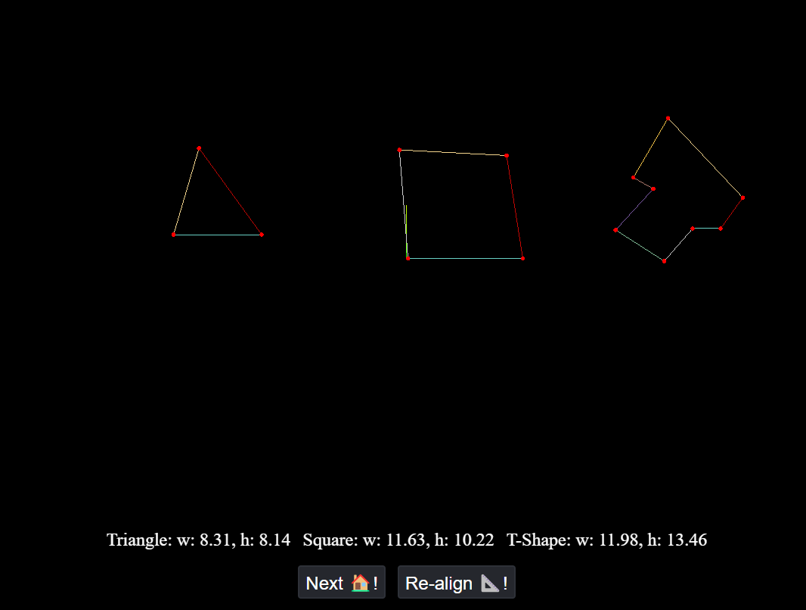

# Setup
Run in console from root:
* `npm i`
* `npx vite`

Under http://localhost:5173 you should see the following:

# Description

Clicking on "Next!" creates 3 new rooms with slightly offset coordinates.
Clicking on "Re-align!" aligns next rooms' wall to X-axis. Clicking on it iterates through every wall.

Below Stats display height and width dimensions of a room (in other words, shape projection on X and Y axes).